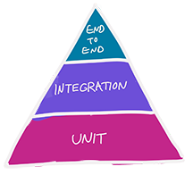

# Testing CRDs

This repo accompanies the talk [Testing Kubernetes CRDs](https://kccncchina2018english.sched.com/event/FuJa/testing-kubernetes-crds-christie-wilson-google)
at Kubecon Shanghai 2018.

* [Kubebuilder integration tests](#integration-tests-with-kubebuilder)
* [End-to-end tests](#end-to-end-tests)

## Tests



#### Integration tests with kubebuilder

These tests are generated by kubebuilder and use [Ginkgo](https://github.com/onsi/ginkgo).
They will start a controller process and api server locally.

The test (which hasn't been modified from the default) lives in
[feline_controller_test.go](kubebuilder/pkg/controller/feline/feline_controller_test.go).

To run these tests:

```bash
go test ./pkg/controller/feline
```

### End to end tests

After you have [deployed the controller](DEVELOPMENT.md#deploying), you can run the integration tests against
[the `current-context` cluster in your kube config](https://kubernetes.io/docs/concepts/configuration/organize-cluster-access-kubeconfig/):

```bash
go test -v -count=1 -tags=e2e ./client-go/test
go test -v -count=1 -tags=e2e ./kubebuilder/test
```

_`-count=1` is [the idiomatic way to disable test caching](https://golang.org/doc/go1.10#test)._

You can override the kubeconfig and context if you'd like:

```bash
go test -v -tags=e2e -count=1 ./client-go/test --kubeconfig ~/special/kubeconfig --cluster myspecialcluster
```